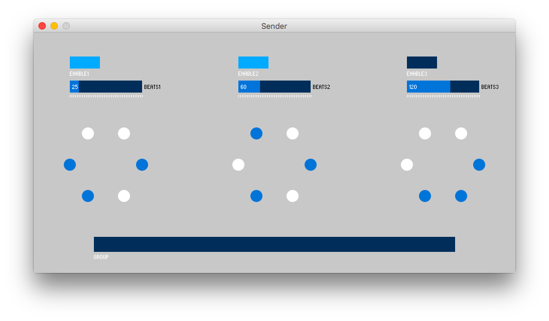

# Alfheim

An internet of lights and sounds project.

## Requirements

- 3 Raspberry Pi's
- Processing
  - IO
  - OOCSI
  - controlP5
- Pure Data

## How to run

The code contains one for sender and three for receivers.

1. On sender machine, run Processing `Sender/Sender.pde`. This will open an interface for controlling the receiver machines.
2. On the first receiver machine, run Pure Data `Receiver/PdOne/oscPDtest.pd`, then run Processing `Receiver/ReceiverOne/ReceiverOne.pde`.
3. For the second and the third receiver machine, similar to step 2.
